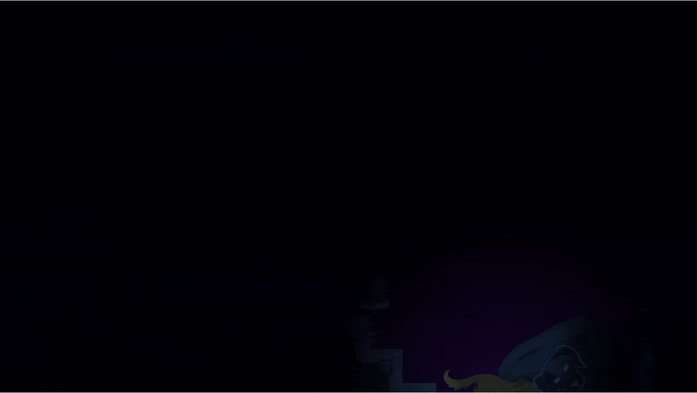
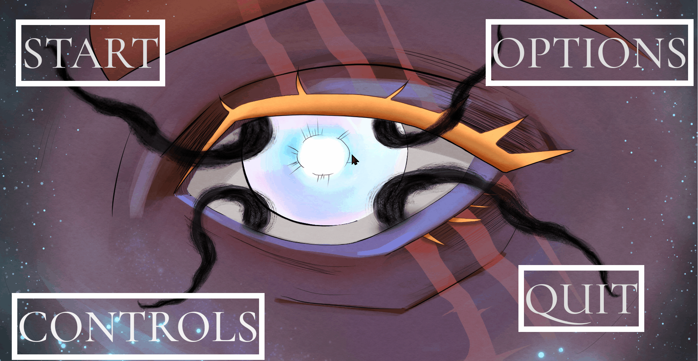
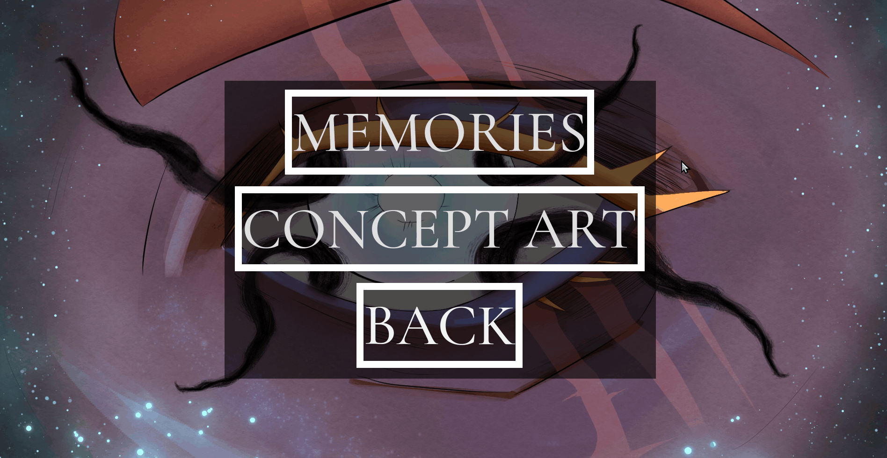
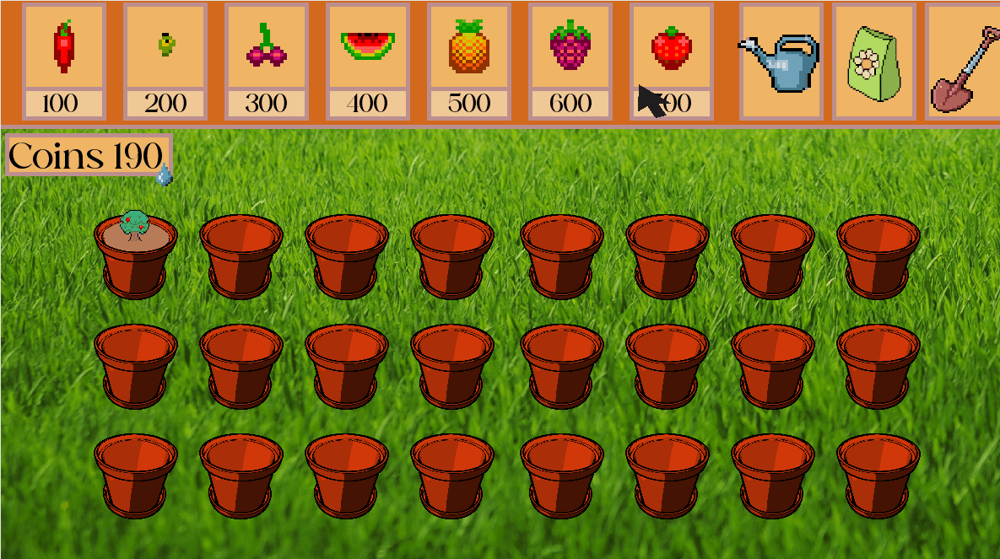

<html>

<head>

	<title>Portfolio</title>

	

	<meta name ="Creater" content = "Kali">
	<meta name = "Content" content = "Portfolio">
	<meta name = "Keywords" content ="Portfolio">
	

	<link rel="stylesheet" href="style.css" type ="text/css" >
	
</head>

<body>
	
	<main>
	
	<h1>Portfolio</h1>

	
	<h2>Blindside</h2>
	<a link href="https://midnight-studioss.itch.io/blindside">itch.io</a>
	
Blindside was my DES315 project. My main area was interactions between the players and objects. This was the focus of the second puzzle room that required the players to move boulders and punish them if they failed.

	

	
I was also the main programmer involved in implementing the menus and subsequent logic.

	
	
	
			
	<iframe width="560" height="315" src="https://www.youtube.com/embed/zRCwHdYEWJk?si=ImFDgYDX3LyM69mH" title="YouTube video player" frameborder="0" allow="accelerometer; autoplay; clipboard-write; encrypted-media; gyroscope; picture-in-picture; web-share" referrerpolicy="strict-origin-when-cross-origin" allowfullscreen></iframe>
	
	<h2>Zen Garden</h2>
	
This was a personal project I did over summer 2024. The core gameplay loop is planting seeds, watering/fertilising plants to get coins and then planting more seeds. 

	
The game also features a save system so it can be closed and reopened without losing any progress.

	
	
	
As this was a personal project and I am mainly a programmer, I used premade assets for the graphics and animations. Editing a few as needed for the project.

	
	</main>
	
	
</body>

</html>
